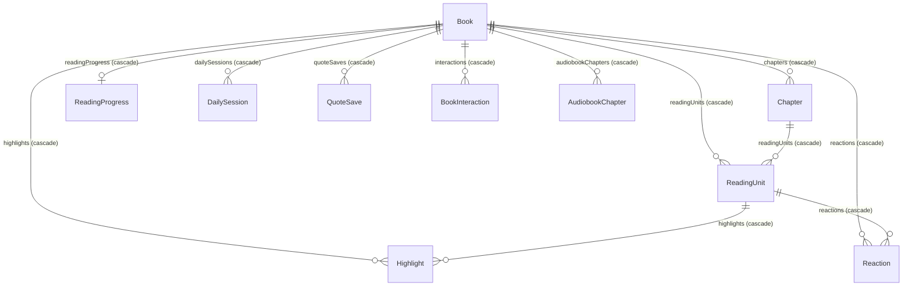
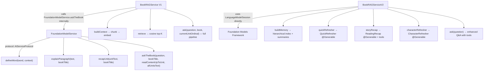
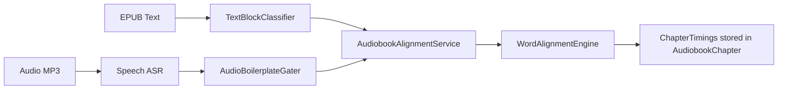

# Spine — Lossless Technical Recreation Spec

> **Scope**: This document is a **complete architecture and implementation blueprint** for the Spine iOS app. It specifies every data model, service, algorithm, enum, relationship, and view state machine with enough precision to recreate the project from scratch, audit every component, or feed to an LLM for full reconstruction.

---

## 1. Project Identity

| Key | Value |
|-----|-------|
| **App Name** | Spine |
| **Bundle ID** | `com.spine.app` |
| **Platform** | iOS 26+, Swift 6, SwiftUI |
| **Tagline** | "A beautiful reading gym for ambitious people" |
| **Data Layer** | SwiftData (fully local persistence — no CloudKit sync for models) |
| **AI Layer** | Apple Foundation Models (fully on-device, no API keys, no network) |
| **CloudKit** | Container `iCloud.com.spine.app` — used **only** for social features via `CloudKitSocialService`. No SwiftData models sync to CloudKit. |
| **Xcode** | 26+ (iOS 26 SDK) |
| **Dependencies** | Zero external — pure Apple frameworks (SwiftUI, SwiftData, FoundationModels, NaturalLanguage, CloudKit, Speech, AVFoundation) |

---

## 2. Project Structure

```
Spine/
├── App/
│   └── SpineApp.swift
├── Design/
│   ├── DesignTokens.swift
│   └── Components.swift
├── Extensions/
│   ├── Color+Hex.swift
│   └── Extensions.swift
├── Features/
│   ├── Gamification/
│   │   ├── AchievementGallery.swift
│   │   ├── CelebrationOverlay.swift
│   │   ├── XPProgressBar.swift
│   │   └── XPToast.swift
│   ├── Highlights/
│   │   └── HighlightsView.swift
│   ├── Library/
│   │   ├── AddPhysicalBookView.swift     ← NEW (physical book entry)
│   │   ├── CatalogView.swift
│   │   ├── ForYouView.swift
│   │   ├── LibraryView.swift
│   │   └── PhysicalBookTrackerView.swift ← NEW (chapter grid + XP)
│   ├── Onboarding/
│   │   ├── OnboardingView.swift
│   │   └── TasteOnboardingView.swift
│   ├── Paths/
│   │   ├── PathDetailView.swift
│   │   └── PathsView.swift
│   ├── Premium/
│   │   └── PaywallView.swift
│   ├── Profile/
│   │   ├── ProfileView.swift
│   │   └── SettingsView.swift
│   ├── Reactions/
│   │   ├── MicroReasonSheet.swift
│   │   └── ReactionSheet.swift
│   ├── Reader/
│   │   ├── AskTheBookView.swift
│   │   ├── AudioImportSheet.swift
│   │   ├── AudioMiniPlayerView.swift
│   │   ├── AudiobookPlayerView.swift
│   │   ├── CodexView.swift
│   │   ├── DefineWordSheet.swift
│   │   ├── ExplainParagraphSheet.swift
│   │   ├── KaraokeTextView.swift          ← NEW (word-level highlighting)
│   │   ├── ReaderView.swift
│   │   └── SelectableTextView.swift
│   ├── Social/
│   │   ├── DiscussionView.swift
│   │   ├── PublicProfileView.swift
│   │   ├── ReadingClubView.swift
│   │   ├── ReferralView.swift
│   │   └── ShareHighlightSheet.swift
│   ├── Today/
│   │   └── TodayView.swift
│   └── Vocabulary/
│       ├── ReviewSessionView.swift
│       └── VocabularyDeckView.swift
├── Models/
│   ├── AudiobookChapter.swift
│   ├── AudioSyncModels.swift              ← NEW (TimedWord, TimedPhrase, ChapterTimings)
│   ├── AuthorMetadata.swift
│   ├── Book.swift
│   ├── BookIntelligence.swift
│   ├── BookInteraction.swift
│   ├── Chapter.swift
│   ├── DailySession.swift
│   ├── Highlight.swift
│   ├── League.swift
│   ├── QuoteSave.swift
│   ├── Reaction.swift
│   ├── ReadingClub.swift
│   ├── ReadingPath.swift
│   ├── ReadingProgress.swift
│   ├── ReadingRecap.swift
│   ├── ReadingUnit.swift
│   ├── Season.swift
│   ├── UserSettings.swift
│   ├── UserTasteProfile.swift
│   ├── VocabularyWord.swift
│   └── XPProfile.swift
├── Services/
│   ├── AchievementEngine.swift
│   ├── AnalyticsService.swift
│   ├── AudioBoilerplateGater.swift        ← NEW (boilerplate detection)
│   ├── AudioPlaybackEngine.swift
│   ├── AudioSyncService.swift
│   ├── AudiobookAlignmentService.swift    ← NEW (alignment orchestrator)
│   ├── AudiobookDownloadService.swift
│   ├── BookIntelligenceService.swift
│   ├── BookMemoryIndex.swift
│   ├── BookRAGService.swift
│   ├── BookRAGServiceV2.swift
│   ├── BookRetrievalTools.swift
│   ├── BundledLibraryScanner.swift
│   ├── CharacterTracker.swift
│   ├── CloudKitSocialService.swift
│   ├── CoverCacheService.swift
│   ├── DownloadService.swift
│   ├── EmbeddingService.swift
│   ├── EPUBParser/
│   │   ├── ContentNormalizer.swift
│   │   ├── EPUBModels.swift
│   │   ├── EPUBParser.swift
│   │   └── MiniZIP.swift
│   ├── FoundationModelService.swift
│   ├── IngestionPipeline.swift
│   ├── LibriVoxService.swift
│   ├── PremiumManager.swift
│   ├── ProgressTracker.swift
│   ├── RecommendationService.swift
│   ├── SegmentationEngine.swift
│   ├── StreakCalculator.swift
│   ├── TextBlockClassifier.swift          ← NEW (ebook content classification)
│   ├── WordAlignmentEngine.swift          ← NEW (Smith-Waterman alignment)
│   └── XPEngine.swift
├── SeedData/
│   └── SeedCatalog.swift
├── Stubs/
│   └── FeatureFlags.swift
├── Info.plist
└── Spine.entitlements
```

---

## 3. Format-Agnostic Book Sources

Spine tracks three book source types — all earn XP and build streaks:

| Source Type | How Ingested | Progress Tracking | Completion Unit |
|------------|-------------|-------------------|-----------------|
| `gutenberg` | Downloaded from Project Gutenberg catalog, parsed by `EPUBParser` | Per-ReadingUnit (5–10 min segments) | `ReadingUnit.isCompleted` |
| `local` | Imported via Files picker, parsed by `EPUBParser` | Per-ReadingUnit | `ReadingUnit.isCompleted` |
| `physical` | Manually added (title, author, chapter count) | Per-chapter tap-to-complete | `physicalCurrentChapter / totalPhysicalChapters` |

Physical books use `Book.isPhysicalBook` computed property (`sourceType == .physical`). They are marked `isDownloaded = true` and `importStatus = .completed` immediately via the convenience initializer, so they appear in the library without any parsing pipeline.

---

## 4. Data Model (SwiftData)

### 4.1 Entity Relationship Diagram



> [!IMPORTANT]
> **Ordering**: `Book.sortedUnits` and `Book.sortedChapters` are **computed properties** that sort on `.ordinal`. SwiftData relationship arrays are **unordered**. All ordered access goes through these computed getters.

### 4.2 Terminology

| Term | Definition | Scope |
|------|-----------|-------|
| **Chapter** | Structural unit from the EPUB spine. 1:1 with EPUB `<spine>` entries. | Parser output |
| **ReadingUnit** | Consumption unit — a ~5–10 minute reading segment (~1500–3000 words). Generated by `SegmentationEngine` from chapters. | App-facing (EPUB books) |
| **Physical Chapter** | User-declared chapter count for a paper book. Tracked via `totalPhysicalChapters` / `physicalCurrentChapter`. | App-facing (physical books) |
| **AudiobookChapter** | One audio file (MP3) from a LibriVox/uploaded audiobook, with optional alignment data. | Audio pipeline |
| **Unit Summary** | 2-sentence summary generated from one ReadingUnit's plainText | V2 RAG |
| **Chapter Summary** | 1-sentence condensation generated from a unit summary | V2 RAG |
| **Arc Summary** | 1-paragraph synthesis generated from 3 consecutive chapter summaries | V2 RAG |

> [!CAUTION]
> In the current implementation, "chapter summaries" are keyed by **unit ordinal**, not by Chapter.ordinal. This is because a Chapter may have multiple ReadingUnits. The label "chapter summary" refers to a condensed version of a unit summary — it does not aggregate all units within a Chapter. A future refactor should consider true per-Chapter summaries.

---

## 5. AI Layer — Service Hierarchy

> [!IMPORTANT]
> **Canonical call paths** — an implementer must build exactly these three services and their boundaries.



| Service | Role | Called By | Model Access |
|---------|------|-----------|-------------|
| `FoundationModelService` | **Low-level model wrapper**. Wraps `LanguageModelSession` for simple prompt→response tasks. Conforms to `AIServiceProtocol`. | `BookRAGService.ask()`, ReaderView (define word, explain paragraph) | `SystemLanguageModel.default` |
| `BookRAGService` (V1) | **Flat-chunk Q&A**. Semantic retrieval over 500-word chunks with 50-word overlap. Calls `FoundationModelService.askTheBook()` for generation. | `AskTheBookView` (when `advancedRecap` flag is off) | Via `FoundationModelService` |
| `BookRAGServiceV2` | **Hierarchical recap engine**. 5-tier memory, mode-specific scoring, diversity rerank, tool calling. Uses `LanguageModelSession` directly with `@Generable` structured output. | `RecapView`, potentially `AskTheBookView` (when `advancedRecap` flag is on) | `LanguageModelSession` directly |

> `FoundationModelService.askTheBook()` is **not legacy** — it remains the generation backend used by `BookRAGService` V1. V2 bypasses it entirely and talks to `LanguageModelSession` directly with tools and structured output.

---

## 6. Ingestion Pipeline

**File**: `IngestionPipeline.swift` — `@MainActor final class`

**Flow**: EPUB file → Copy to `Documents/EPUBs/` → Parse → Create Book + Chapters → Segment → Create ReadingUnits → Create ReadingProgress → Embed synopsis → Save

### 6.1 EPUB Parser (`EPUBParser/`)

| File | Lines | Role |
|------|-------|------|
| `EPUBParser.swift` | ~520 | Unzip → `container.xml` → `content.opf` → metadata + spine + manifest → per-chapter HTML+plainText extraction. Cover image extraction. |
| `ContentNormalizer.swift` | ~240 | Strip scripts/styles/non-content. Normalize whitespace/encoding. Clean HTML for rendering. |
| `EPUBModels.swift` | ~40 | `ParsedEPUB`, `ParsedChapter`, `EPUBMetadata` value types |
| `MiniZIP.swift` | — | Lightweight unzip utility |

### 6.2 Segmentation Engine (`SegmentationEngine.swift`)

**Config**: `minWords: 1500, maxWords: 3000, targetWords: 2250, wordsPerMinute: 225`

**Algorithm**:
```
for each chapter:
  if chapter.wordCount ∈ [minWords, maxWords] → 1 unit
  if chapter.wordCount < minWords → 1 unit (never merge across chapters)
  if chapter.wordCount > maxWords → split:
    accumulate paragraphs
    when accumulated words ≥ targetWords:
      search last ~33% of accumulated paragraphs for best break
      break priority (highest first):
        1. Scene breaks: "* * *", "---", "⁂", "***", "—", 3+ whitespace-only lines
        2. All-caps headings or "Chapter/Part/Act/Scene/Letter" prefixes
        3. Date-like lines (regex: /^\d{1,2}\s+\w+\s+\d{4}/ — epistolary detection)
        4. Dialogue transitions: closing quote → non-quote next paragraph
        5. Sentence boundary (period/question/exclamation at end of paragraph)
        6. Paragraph boundary (fallback)
      if no break found and words > maxWords → force-split at paragraph boundary
```

**Output**: `[SegmentedUnit]` — each has `ordinal` (global 0-indexed), `title`, `plainText`, `htmlContent`, `wordCount`, `estimatedMinutes`, `startCharOffset`, `endCharOffset`.

---

## 7. Audiobook System

### 7.1 Audiobook Discovery & Download

**Service**: `LibriVoxService.swift` — searches LibriVox RSS feeds for matching audiobooks by title/author.

**Service**: `AudiobookDownloadService.swift` — per-book download state machine:
- States: `.notAvailable`, `.notDownloaded`, `.downloading(progress)`, `.downloaded`
- Downloads chapter MP3s to `Documents/Audiobooks/{bookId}/`
- Creates `AudiobookChapter` SwiftData models per downloaded file

**Service**: `AudioPlaybackEngine.swift` — AVFoundation-based audio player:
- Chapter sequencing via `onTrackFinished` → auto-advances
- Position save/resume per chapter
- ±15s skip, play/pause, playback rate control

### 7.2 EPUB ↔ Audiobook Cross-Linking

The `ReaderView` headphones button auto-detects whether `book.hasAudiobook`:
- **If audiobook downloaded**: loads chapter MP3s directly, shows `AudioMiniPlayerView`
- **If audiobook available in Discover but not downloaded**: allows download from within reader
- **From AudiobookPlayerView**: book icon in top bar navigates to EPUB if available

### 7.3 Audio Mini Player (`AudioMiniPlayerView.swift`)

Compact bottom bar: chapter title, play/pause, ±15s skip, progress line. Tap bar → expand to full `AudiobookPlayerView`. Dismiss button saves position and stops playback.

### 7.4 Audiobook Alignment Pipeline

Multi-stage pipeline that synchronizes audiobook audio with EPUB text for word-level highlighting:



#### TextBlockClassifier (`TextBlockClassifier.swift`)

Classifies EPUB text blocks into categories:

| BlockKind | Purpose |
|-----------|---------|
| `boilerplate_discard` | LibriVox credits, Project Gutenberg legal, volunteer notes |
| `front_matter_optional` | Preface, foreword, dedication |
| `toc_discard` | Table of contents |
| `chapter_heading_metadata` | Chapter titles, section headers |
| `body_text_keep` | Canonical reading text — target for alignment |
| `footnote_optional` | Footnotes, endnotes |
| `back_matter_optional` | Appendices, afterword |

Rule-based classification using keyword scoring and pattern matching. Heading metadata extraction and main body start detection.

#### AudioBoilerplateGater (`AudioBoilerplateGater.swift`)

Classifies ASR transcript chunks to distinguish book content from non-book speech:
- LibriVox disclaimers ("this is a librivox recording")
- Chapter announcements ("chapter one", "section two")
- Credits ("read by", "recording by")
- End-of-file markers ("end of chapter")

Uses keyword scoring and Jaccard similarity. Outputs skip ranges for non-book speech.

#### WordAlignmentEngine (`WordAlignmentEngine.swift`)

Smith-Waterman local alignment on normalized word sequences:
- **Input**: normalized EPUB word tokens + ASR transcript word tokens with timestamps
- **Output**: `[TimedWord]` — each EPUB word mapped to audio start/end times
- Match/mismatch/gap scoring for fuzzy alignment
- Handles narrator ad-libs, pauses, and text variations

#### AudiobookAlignmentService (`AudiobookAlignmentService.swift`)

Orchestrates the full pipeline per chapter:
1. Maps audiobook chapters to EPUB chapters (ordinal matching)
2. Classifies EPUB text via `TextBlockClassifier` → extracts `body_text_keep` blocks
3. Runs on-device ASR via Speech framework (iOS 26+)
4. Gates boilerplate via `AudioBoilerplateGater`
5. Aligns clean audio transcript to clean EPUB text via `WordAlignmentEngine`
6. Stores resulting `ChapterTimings` in `AudiobookChapter.timingsData`

### 7.5 Audio Sync Models (`AudioSyncModels.swift`)

```swift
struct TimedWord: Codable, Sendable {
    let text: String
    let startTime: TimeInterval
    let endTime: TimeInterval
    let confidence: Float       // 0.0–1.0
}

struct TimedPhrase: Codable, Sendable {
    let words: [TimedWord]
    let startTime: TimeInterval
    let endTime: TimeInterval
}

struct ChapterTimings: Codable, Sendable {
    let words: [TimedWord]
    let phrases: [TimedPhrase]
    
    func activeWordIndex(at time: TimeInterval) -> Int?
    func phraseContaining(wordIndex: Int) -> Int?
}
```

### 7.6 Karaoke Text View (`KaraokeTextView.swift`)

Word-level highlighted text overlay in `ReaderView`:
- Three visual states per word: `.spoken` (past), `.current` (highlighted), `.upcoming` (dimmed)
- Uses `AttributedString` for per-word styling
- Auto-scrolls to keep current word visible
- Tap-to-seek: tapping a word seeks `AudioPlaybackEngine` to that word's `startTime`
- Appears as overlay when `showMiniPlayer == true` and `currentChapterTimings != nil`
- Dismissible header shows alignment status (transcribing/aligning progress)

---

## 8. Physical Book Tracking

### 8.1 Model Extensions (`Book.swift`)

Physical books use four additional fields:

| Field | Type | Purpose |
|-------|------|---------|
| `totalPhysicalChapters` | `Int` | User-declared chapter count |
| `physicalCurrentChapter` | `Int` | Chapters completed so far |
| `userRating` | `Int?` | 1–5 star rating |
| `userNotes` | `String?` | Free-form reading notes |

Computed properties:
- `isPhysicalBook: Bool` — `sourceType == .physical`
- `physicalProgress: Double` — `physicalCurrentChapter / totalPhysicalChapters`

Convenience init: `Book(title:author:totalChapters:bookDescription:coverImageData:)` → sets `sourceType = .physical`, `isDownloaded = true`, `importStatus = .completed`.

### 8.2 XP for Physical Books (`XPEngine.awardPhysicalChapterXP`)

| Component | Value | Condition |
|-----------|-------|-----------|
| Base XP | `20` | Per chapter (slightly less than digital — no WPM verification) |
| Streak Bonus | `+3 × currentStreak` | Capped at `+30` |
| First of Day | `+10` | If `profile.dailyXPDate < today` |
| Book Finish | `+150` | If `physicalCurrentChapter >= totalPhysicalChapters` |
| Speed Bonus | `0` | N/A — can't measure WPM for paper books |

### 8.3 Progress Tracking (`ProgressTracker.completePhysicalChapter`)

1. Guard: `isPhysicalBook && physicalCurrentChapter < totalPhysicalChapters`
2. Advance `physicalCurrentChapter += 1`
3. Create `DailySession` (so streak calculator sees today's activity)
4. Create/update `ReadingProgress` with `completedUnitCount`, `completedPercent`, `lastReadAt`
5. Recalculate streak via `StreakCalculator`
6. Save + analytics

### 8.4 AddPhysicalBookView (`AddPhysicalBookView.swift`)

Sheet for adding paper books:
- Title (required) + Author fields
- Chapter count stepper with +/- buttons and quick presets (10, 20, 30, 50)
- Optional cover photo via `PhotosPicker`
- Optional notes/description

### 8.5 PhysicalBookTrackerView (`PhysicalBookTrackerView.swift`)

Full tracking view:
- **Header**: Cover image, title, author, "Physical Book" badge, completion checkmark
- **Progress ring**: Animated circular progress with percentage + streak display
- **Chapter grid**: `LazyVGrid` showing all chapters as 44×44 cells — completed (gold checkmark), current (outlined), upcoming (dimmed number)
- **Complete button**: Gold CTA: "Complete Chapter N" with "+20 XP" subtitle → calls `completePhysicalChapter` + `awardPhysicalChapterXP` → shows `XPToast`
- **Rating**: 5-star tappable rating — tap same star to clear
- **Notes**: Editable text area with Save/Edit toggle

### 8.6 Library Integration (`LibraryView.swift`)

- **Query**: `isDownloaded == true || hasAudiobook == true` (physical books have `isDownloaded = true`)
- **Segments**: Added `physicalBooks = "Physical"` to `LibrarySegment` enum
- **Toolbar**: "+" button is now a `Menu` with "Import EPUB" and "Add Physical Book"
- **Physical Books section**: Grid of physical book cards with gradient covers, progress badges (e.g. "3/20"), and tap-to-navigate to `PhysicalBookTrackerView`
- **Navigation**: `selectedBook` destination checks `book.isPhysicalBook` — routes to `PhysicalBookTrackerView` instead of `BookDetailView`
- **Cross-segment visibility**: Physical books appear in "All", "Continue" (if in progress), and "Completed" segments

---

## 9. Recommendation Engine

**File**: `RecommendationService.swift` — `struct RecommendationService: Sendable`

### 9.1 Scoring Formula

```
score = 0.30 × genreMatch
      + 0.25 × vibeMatch
      + 0.20 × synopsisSimilarity
      + 0.15 × coLiked
      + 0.10 × noveltyBonus
      − 0.40 × avoidedVibePenalty
```

### 9.2 Signal Computation (exact)

**genreMatch**:
```swift
let matchingGenres = book.genres.filter { g in
    profile.preferredGenres.contains { $0.name == g }
}
let totalWeight = matchingGenres.reduce(0.0) { sum, g in
    sum + (profile.preferredGenres.first { $0.name == g }?.weight ?? 0)
}
return profile.preferredGenres.isEmpty ? 0 : totalWeight / Double(profile.preferredGenres.count)
```

**vibeMatch**: Same structure as genreMatch but over `book.vibes` vs `profile.preferredVibes`.

**avoidedVibePenalty**: `book.vibes.contains(where: { profile.avoidedVibes.contains($0) }) ? 1.0 : 0.0`

**synopsisSimilarity**: Average cosine similarity between `book.synopsisEmbedding` and each liked book's `synopsisEmbedding` (liked = `BookInteraction` with `.rated` and `rating >= 3`, or `.finished`).

**coLiked**: For each liked book, count shared genres + shared vibes between candidate and liked book. Normalize by total candidate genres+vibes. Average across all liked books. *(Placeholder — future: `MLRecommender`)*

**noveltyBonus**: `1.0 - (sameGenreCount / totalCandidates)` where `sameGenreCount` = number of candidates sharing the candidate's primary genre. `totalCandidates` = candidates.count. If `totalCandidates == 0`, returns 0.

### 9.3 Exclusion

Books excluded if user has `BookInteraction` with `.finished` or `.dismissed` for that book.

### 9.4 Output

Returns `[ScoredBook]` — `(book: Book, score: Double, rationale: String)`.

### 9.5 Taste Profile Evolution

| Method | Effect |
|--------|--------|
| `reinforceVibe(_:boost:)` | `weight += boost` (default 0.1), capped at 1.0. If vibe not in `preferredVibes`, adds it at weight `0.5 + boost`. |
| `penalizeVibe(_:)` | `weight -= 0.15`. If weight drops below 0.1, removes from `preferredVibes` and adds to `avoidedVibes`. |

---

## 10. Embedding Service

**File**: `EmbeddingService.swift` — `struct EmbeddingService: Sendable`

| Method | Signature | Notes |
|--------|-----------|-------|
| `embed(text:)` | `(String) → [Double]?` | `NLEmbedding.sentenceEmbedding(for: .english)` |
| `cosineSimilarity(_:_:)` | `([Double], [Double]) → Double` | dot / (‖a‖ × ‖b‖) |
| `encode(_:)` | `([Double]) → Data` | `JSONEncoder` serialization |
| `decode(_:)` | `(Data) → [Double]` | `JSONDecoder` deserialization |

---

## 11. BookRAGService V1

**File**: `BookRAGService.swift` — `struct BookRAGService: Sendable`

1. **`buildContext(book:upToUnit:chunkSize:)`**: Chunks all read units into 500-word segments with 50-word overlap. Embeds each chunk via `EmbeddingService`.
2. **`retrieve(query:from:topK:)`**: Cosine similarity ranking, returns top-3. Fallback: last 3 chunks if query embedding fails.
3. **`ask(question:book:currentUnitOrdinal:)`**: Full pipeline → calls `FoundationModelService.askTheBook()` with retrieved chunks as context.

---

## 12. Advanced RAG System (V2)

### 12.1 BookMemoryIndex (`BookMemoryIndex.swift`)

**Class**: `final class BookMemoryIndex: @unchecked Sendable`

**MemoryEntry** struct:

| Field | Type | Purpose |
|-------|------|---------|
| `id` | `String` | Pattern: `"{tier}-{unitOrdinal}-{counter}"` |
| `text` | `String` | Content |
| `embedding` | `[Double]` | NLEmbedding vector |
| `unitOrdinal` | `Int` | Source position |
| `tier` | `Tier` | `.chunk(0)`, `.scene(1)`, `.unitSummary(2)`, `.chapterSummary(3)`, `.arcSummary(4)` |
| `entityMentions` | `Set<String>` | Lowercased names from NLTagger |
| `eventDensity` | `Double` | See formula below |
| `sourceRange` | `ClosedRange<Int>` | Start–end unit ordinals |
| `adjacentEntryIDs` | `[String]` | Linked neighbors for expansion |

**eventDensity formula**:
```
markers = ["said","told","asked","replied","went","came","arrived","left","found",
           "discovered","realized","learned","killed","died","married","fought",
           "escaped","suddenly","finally"]
words = text.lowercased().split(" ")
if words.count ≤ 10: return 0
count = words matching any marker (after trimming punctuation)
return min(1.0, count / words.count × 10.0)
```

**Entity side-index**: `entityIndex: [String: EntityEntry]` — key = `name.lowercased()`, value stores `(name: String, type: String, unitOrdinals: Set<Int>, totalMentions: Int)`.

**Build process** (`buildIndex(from:upToUnit:chunkSize:overlapSize:)`):
1. For each read unit:
   - Produce chunks: `chunkSize=300` words, `overlapSize=50` words overlap
   - Produce scenes: `text.components(separatedBy: "\n\n")`, filtered to `>50 chars`
   - Link adjacent chunk IDs bidirectionally
   - Run NLTagger for entity extraction
2. Set `isBuilt = true`

**Summary injection** (called by `BookRAGServiceV2.buildMemory()`):
- `addUnitSummary(_:forUnit:)` → adds `.unitSummary` entry, keys to `unitSummaries[ordinal]`
- `addChapterSummary(_:forUnit:)` → adds `.chapterSummary` entry, keys to `chapterSummaries[ordinal]`
- `addArcSummary(_:startUnit:endUnit:)` → adds `.arcSummary` entry, keys to `arcSummaries[startUnit]`

### 12.2 BookRAGServiceV2 (`BookRAGServiceV2.swift`)

**Class**: `final class BookRAGServiceV2: @unchecked Sendable`

**`buildMemory(book:upToUnit:)`** — called lazily by every public method:
```
if memoryIndex.isBuilt: return
memoryIndex.buildIndex(from: book, upToUnit: currentOrdinal)
for each readUnit where unitSummaries[ordinal] == nil:
    unitSummary = summarize(unit.plainText, prompt: "Summarize in 2 sentences…")
    memoryIndex.addUnitSummary(unitSummary, forUnit: ordinal)
for each readUnit where chapterSummaries[ordinal] == nil:
    if unitSummary exists:
        chapterSummary = summarize(unitSummary, prompt: "Rewrite as one-sentence chapter recap…")
        memoryIndex.addChapterSummary(chapterSummary, forUnit: ordinal)
arcStart = 0, arcSize = 3
while arcStart + arcSize - 1 <= currentOrdinal:
    combined = chapterSummaries[arcStart..arcStart+arcSize-1].joined
    arcSummary = summarize(combined, prompt: "Synthesize into one paragraph…")
    memoryIndex.addArcSummary(arcSummary, startUnit: arcStart, endUnit: arcStart+arcSize-1)
    arcStart += arcSize
```

### 12.3 Three-Stage Retrieval (`assembleMemoryPack`)

**Stage 1 — Per-tier budget selection** (`retrievePerTier`):

| Mode | arc | chapter | unit | scene | chunk |
|------|-----|---------|------|-------|-------|
| `.quick` | 0 | 2 | 3 | 1 | 0 |
| `.storySoFar` | 2 | 3 | 2 | 3 | 0 |
| `.character()` | 1 | 2 | 1 | 4 | 2 |

**Scoring function** (`computeScore`):
```
similarity = max(0, cosineSimilarity(queryEmbed, entry.embedding))
recency = exp(-2.0 × distance / maxDist)
proximity = 1.0 if gap ≤ 2, 0.5 if gap ≤ 5, 0.1 otherwise
entityOverlap = |queryEntities ∩ entry.entityMentions| / |queryEntities|
tierBoost = {arcSummary: 1.0, chapterSummary: 0.8, unitSummary: 0.6, scene: 0.3, chunk: 0.0}

score = w.semantic × similarity + w.recency × recency + w.proximity × proximity
      + w.entity × entityOverlap + w.summaryTier × tierBoost
```

**Mode weights**:
```
              semantic  recency  proximity  entity  summaryTier
Quick           0.10     0.35      0.25     0.10      0.20
Story So Far    0.20     0.15      0.10     0.10      0.45
Character       0.15     0.10      0.05     0.50      0.20
```

**Stage 2 — Diversity reranking** (`rerankWithDiversity`):
- Penalizes same-unit clustering (`unitCount × 0.3`)
- Rewards higher tiers (`tier.rawValue × 0.1`)
- Penalizes semantic redundancy (cosine > 0.85 → `+0.5` penalty)

**Stage 3 — Adjacent expansion** (`expandWithNeighbors`):
- For top 2 scene/chunk entries: get neighbors, filter by spoiler ceiling, add to result
- Sort by unitOrdinal (narrative order)

Word budgets: Quick=600, StorySoFar=800, Character=700, Ask=700.

### 12.4 @Generable Structured Output (`ReadingRecap.swift`)

```swift
@Generable(description: "A spoiler-safe reading recap")
struct ReadingRecap {
    @Guide(description: "Key plot events, max 7")      let majorEvents: [String]
    @Guide(description: "Where major characters stand") let characterUpdates: [CharacterUpdate]
    @Guide(description: "Unresolved plot threads")      let unresolvedThreads: [String]
    @Guide(description: "Details the reader should remember") let importantDetailsToRemember: [String]
    @Guide(description: "One paragraph story recap")    let recapParagraph: String
    @Guide(description: "Coverage note")                let coverageNote: String
}

@Generable struct QuickRefresher { let bullets: [String] }
@Generable struct CharacterRefresher { let characters: [CharacterUpdate] }
```

### 12.5 Tool Calling (`BookRetrievalTools.swift`)

| Tool | Args | Output |
|------|------|--------|
| `RecentChapterSummariesTool` | `count: Int` (max 5) | Top-N chapter summaries, most recent first |
| `SearchRelevantScenesTool` | `query: String` | Top-3 scenes by cosine similarity, spoiler-bounded |
| `CharacterArcTool` | `characterName: String` | Mention count + unit appearances |

All tool outputs are terse strings (~50–200 chars) to conserve the 4096-token context window.

---

## 13. Character Tracker & Codex

### 13.1 CharacterTracker (`CharacterTracker.swift`)

**Struct**: `struct CharacterTracker: Sendable`

**Entity extraction**: `NLTagger(tagSchemes: [.nameType])` with `.joinNames` option.

Two modes:
1. **`extractCharacters(from:upToUnit:) → [CharacterInfo]`**: All `.personalName` entities from read units.
2. **`extractEntities(from:) → [EntityInfo]`**: Single-unit X-Ray. Extracts `.personalName`, `.placeName`, `.organizationName`.

### 13.2 CodexView

Filter pills: All / Characters / Locations / Groups. Entity cards with mention counts and first appearance. Tappable detail with AI-generated description. Spoiler-safe.

---

## 14. Gamification System

### 14.1 XP Engine (`XPEngine.swift`)

**Struct**: `@MainActor struct XPEngine`

**Digital Book XP** (`awardXP`):

| Component | Value | Condition |
|-----------|-------|-----------|
| Base XP | `10` | Always |
| Difficulty Bonus | `+5` | If unit wordCount > 3000 |
| Streak Bonus | `+3 × currentStreak` | Capped at `+30` |
| Speed Bonus | `+5` | If WPM > `profile.averageWPM` AND `averageWPM > 0` |
| First of Day | `+10` | If `profile.dailyXPDate < today` |
| Book Finish | `+150` | If `book.readingUnits.allSatisfy { $0.isCompleted }` |

**Physical Book XP** (`awardPhysicalChapterXP`): See §8.2.

**WPM calculation**: `wordCount / minutesSpent` — returns 0 if `minutesSpent < 0.1`.

### 14.2 XP Profile (`XPProfile.swift`)

**WPM tracking**: Exponential moving average — `averageWPM = 0.3 × wpm + 0.7 × averageWPM` (first session: `averageWPM = wpm`). Sanity check: `wpm > 0 && wpm < 1500`.

**Level thresholds** (all 15):

| Level | XP | Title |
|-------|----|-------|
| 1 | 0 | Bookworm |
| 2 | 50 | Page Turner |
| 3 | 150 | Chapter Chaser |
| 4 | 300 | Story Seeker |
| 5 | 500 | Novel Navigator |
| 6 | 750 | Prose Pathfinder |
| 7 | 1100 | Verse Voyager |
| 8 | 1500 | Tome Traveler |
| 9 | 2000 | Literary Lion |
| 10 | 2700 | Saga Scholar |
| 11 | 3500 | Epic Explorer |
| 12 | 4500 | Canon Keeper |
| 13 | 5500 | Spine Master |
| 14 | 7000 | Archive Architect |
| 15 | 9000 | Grand Librarian |

### 14.3 Achievement Engine (`AchievementEngine.swift`)

16 achievements across 4 categories:

| ID | Name | Threshold | Category |
|----|------|-----------|----------|
| `first_unit` | First Steps | units ≥ 1 | Milestones |
| `units_10` | Getting Started | units ≥ 10 | Milestones |
| `units_50` | Dedicated | units ≥ 50 | Milestones |
| `units_100` | Centurion | units ≥ 100 | Milestones |
| `book_1` | One Down | books ≥ 1 | Milestones |
| `book_5` | Shelf Builder | books ≥ 5 | Milestones |
| `streak_3` | On a Roll | streak ≥ 3 | Streaks |
| `streak_7` | Week Warrior | streak ≥ 7 | Streaks |
| `streak_14` | Fortnight Force | streak ≥ 14 | Streaks |
| `streak_30` | Iron Will | streak ≥ 30 | Streaks |
| `speed_200` | Swift Reader | WPM ≥ 200 | Skills |
| `speed_300` | Speed Demon | WPM ≥ 300 | Skills |
| `xp_100` | Century | dailyXP ≥ 100 | Skills |
| `consistent_7` | Rock Solid | dailyGoalHits ≥ 7 | Skills |
| `night_owl` | Night Owl | hour ≥ 22 OR hour < 4 | Lifestyle |
| `early_bird` | First Light | 4 ≤ hour < 7 | Lifestyle |

### 14.4 Streak Calculator (`StreakCalculator.swift`)

**Struct**: `struct StreakCalculator: Sendable`

Algorithm:
```
readingDays = Set of startOfDay(session.sessionDate) for completed sessions
currentStreak: walk backwards from today counting consecutive days
longestStreak: walk forwards counting max consecutive run
```

---

## 15. Social Layer (CloudKit)

**File**: `CloudKitSocialService.swift` — container `iCloud.com.spine.app`

| Function | CKRecord Type | Notes |
|----------|---------------|-------|
| `getDiscussion(bookId:unitOrdinal:)` | `DiscussionPost` | Gracefully handles missing record type |
| `postToDiscussion(…text:)` | `DiscussionPost` | Optimistic local append |
| `shareHighlight(…)` | `SharedHighlight` | |
| `getPublicProfile(userId:)` | `PublicProfile` | |
| Club operations | `ReadingClub` | Create, join, fetch |

### 15.1 ReadingClub Persistence Boundary

`ReadingClub` is a **local-only SwiftData model** with `cloudKitRecordId: String?`. It is **never auto-synced** by SwiftData. Manual `CKRecord` operations in `CloudKitSocialService`.

---

## 16. Vocabulary System

### 16.1 VocabularyWord Model

Saved from "Define Word" flow in reader. Stores word, definition, context sentence, book reference.

### 16.2 VocabularyDeckView

Flashcard-style review with spaced repetition. `ReviewSessionView` handles quiz mechanics.

---

## 17. Design System (`SpineTokens`)

### 17.1 Color Palette

| Token | Hex | Usage |
|-------|-----|-------|
| `cream` | `#FAF7F2` | Primary background |
| `warmStone` | `#E8E0D8` | Secondary background |
| `parchment` | `#F5F0E8` | Card backgrounds |
| `espresso` | `#4A3728` | Primary text |
| `ink` | `#1C1C1E` | Dark text |
| `accentGold` | `#C49B5C` | Primary accent, buttons, active states |
| `accentAmber` | `#D4A853` | Secondary accent |
| `streakFlame` | `#E8734A` | Streak displays, urgency |
| `successGreen` | `#4CAF82` | Completion states |
| `subtleGray` | `#8E8E93` | Secondary text |

### 17.2 Reader Themes

| Theme | Background | Text |
|-------|-----------|------|
| `.light` | `cream` | `espresso` |
| `.sepia` | `#F4ECD8` | `#5B4636` |
| `.dark` | `#1C1C1E` | `#E5E5EA` |

### 17.3 Spacing Scale (in points)

`xxxs:2, xxs:4, xs:8, sm:12, md:16, lg:24, xl:32, xxl:48, xxxl:64`

---

## 18. Reader State Machine (`ReaderView.swift`)

### 18.1 Sheet State Machine

Single-sheet enum pattern — only one sheet can be active at a time:

```swift
enum ReaderSheet: Identifiable {
    case settings, reaction, highlight, microReason,
         defineWord, explainParagraph, askTheBook,
         codex, recap, discussion, shareHighlight
    var id: String { String(describing: self) }
}
@State private var activeSheet: ReaderSheet?
```

### 18.2 Unit Completion Flow

```
1. completeCurrentUnit() called
2. ProgressTracker.completeUnit() marks unit + session
3. XPEngine.awardXP() → XPReward
4. modelContext.save()
5. if didLevelUp || newAchievements: showCelebration = true
   else: showXPToast = true
6. if completedCount % 5 == 0: after 3s delay → activeSheet = .microReason
```

### 18.3 Audiobook Integration in Reader

- `@State var showMiniPlayer` — toggled by headphones button
- `@State var currentChapterTimings: ChapterTimings?` — loaded from `AudiobookChapter.timings`
- `@State var activeWordIndex: Int?` — current highlighted word
- `@State var activePhraseRange: Range<Int>?` — current highlighted phrase
- `playbackTrackingTimer` — fires at ~30Hz to update highlighting via `ChapterTimings.activeWordIndex(at:)`
- `KaraokeTextView` overlay with dismiss header and alignment status

### 18.4 AI Unavailability

`FoundationModelService.isAvailable` checks `SystemLanguageModel.default.isAvailable`. If false:
- `summarize()` returns nil → summaries skipped
- Feature flag buttons still show
- Runtime errors caught and displayed in view error states

---

## 19. Tab Navigation

| Tab | View | Icon |
|-----|------|------|
| Today | `TodayView` | `sun.max.fill` |
| Library | `LibraryView` | `books.vertical.fill` |
| Highlights | `HighlightsView` | `highlighter` |
| Social | `ReadingClubView` | `person.2.fill` |
| Profile | `ProfileView` | `person.fill` |

---

## 20. Feature Flags (`FeatureFlags.swift`)

| Phase | Flags (all `true` = shipped) |
|-------|-----|
| **1: Core Habit** | `epubIngestion`, `dailySegmentation`, `streakTracking`, `highlights`, `reactions` |
| **2: AI Foundations** | `arbitraryEPUBImport`, `defineWord`, `explainParagraph`, `unitRecap`, `librarySync` (false) |
| **3: Intelligence** | `progressAwareRetrieval`, `characterGraph`, `askTheBook`, `xRay`, `advancedRecap` |
| **4: Social** | `chapterGatedDiscussions`, `readingClubs`, `publicProfiles`, `highlightSharing` |

---

## 21. Analytics (`AnalyticsService.swift`)

Non-blocking, batched telemetry. Events logged locally with optional future backend:

| Event | When |
|-------|------|
| `book_import_started` | EPUB import begins |
| `book_import_completed` | EPUB parsed + segmented (also used for physical book adds) |
| `book_import_failed` | Parse/segment error |
| `book_opened` | User opens a book |
| `reading_unit_completed` | Unit finished (digital or physical chapter) |
| `achievement_unlocked` | New achievement earned |
| `highlight_created` | Text highlighted |
| `reaction_added` | Reaction selected |
| `discussion_posted` | Social post |
| `audiobook_download_started` | Audiobook download begins |

---

## 22. Key Architectural Decisions

1. **Reading Units ≠ Chapters**: Chapters are EPUB structural. ReadingUnits are consumption-sized (~5–10 min). This enables daily habits, per-unit progress, and precise spoiler ceilings.

2. **Format-agnostic progress**: EPUBs, audiobooks, and physical books all flow into the same streak/XP/progress system. The `DailySession` + `StreakCalculator` + `XPEngine` pipeline doesn't care about the source format.

3. **Spoiler ceiling enforced at data layer**: Every AI service filters by `unitOrdinal ≤ currentUnitOrdinal`.

4. **Recap ≠ QA**: `BookRAGService` (V1) is flat-chunk semantic search for Q&A. `BookRAGServiceV2` is hierarchical memory reconstruction for recap. Different retrieval strategies, different output schemas.

5. **On-device AI only**: No API keys, no network calls for AI. Graceful degradation.

6. **Audiobook alignment as sequence problem**: The pipeline treats EPUB ↔ audio sync as fuzzy sequence alignment (classify → transcribe → gate → align), not naive timestamp matching.

7. **Trust-based physical tracking**: No anti-exploit timer for physical books. Users tap "Complete Chapter" on the honor system. This is intentional — Spine is a reading gym, not a DRM system.

8. **Token budget management** (4096-token context window): Hierarchical summaries, compact `@Generable` schemas, separate summarization sessions, terse tool outputs, hard word limits on memory packs.

---

## Appendix A: Key Storage Schema Additions

### AudiobookChapter (extended)

```swift
@Model final class AudiobookChapter {
    @Attribute(.unique) var id: UUID
    var book: Book?
    var chapterNumber: Int
    var title: String
    var audioURL: String
    var durationSeconds: Double
    var isListened: Bool
    var lastPosition: Double
    
    // Alignment data
    @Attribute(.externalStorage) var timingsData: Data?    // Encoded ChapterTimings
    @Attribute(.externalStorage) var transcriptText: String?
    var alignmentConfidence: Double
    var matchedEpubChapterOrdinal: Int?
    
    var timings: ChapterTimings? { /* decode from timingsData */ }
}
```

### Book (physical extensions)

```swift
// Added to Book model:
var totalPhysicalChapters: Int       // default 0
var physicalCurrentChapter: Int      // default 0
var userRating: Int?                 // 1–5 stars
var userNotes: String?               // free-form

var isPhysicalBook: Bool { sourceType == .physical }
var physicalProgress: Double { /* currentChapter / totalChapters */ }
```

---

## Appendix B: All Enums

```swift
enum BookSourceType: String, Codable, CaseIterable, Sendable {
    case gutenberg, local, physical
}

enum ImportStatus: String, Codable, Sendable {
    case pending, parsing, segmenting, completed, failed
}

enum InteractionType: String, Codable, CaseIterable, Sendable {
    case finished, abandoned, rated, reviewed, readLater, dismissed, opened
}

enum ReaderTheme: String, Codable, CaseIterable, Sendable {
    case light, sepia, dark
}

enum ReadingGoal: Int, Codable, CaseIterable, Sendable {
    case fiveMinutes = 5, tenMinutes = 10, fifteenMinutes = 15
}

enum PacePreference: String, Codable, CaseIterable, Sendable {
    case short, medium, long, any
}

enum ReactionType: String, Codable, CaseIterable, Sendable {
    case lovedIt = "Loved it"
    case confused = "Confused"
    case beautifullyWritten = "Beautifully written"
    case dark = "Dark"
    case funny = "Funny"
    case dense = "Dense"
}

enum RecapMode {
    case quick, storySoFar, character(name: String? = nil)
}

enum Tier: Int, Sendable, Comparable {
    case chunk = 0, scene = 1, unitSummary = 2, chapterSummary = 3, arcSummary = 4
}

enum Category: String, Sendable, CaseIterable {
    case streak = "Streaks", milestone = "Milestones", skill = "Skills", lifestyle = "Lifestyle"
}

// TextBlockClassifier
enum BlockKind: String, CaseIterable {
    case boilerplate_discard, front_matter_optional, toc_discard,
         chapter_heading_metadata, body_text_keep, footnote_optional,
         back_matter_optional
}

// LibraryView
enum LibrarySegment: String, CaseIterable {
    case continueReading = "Continue"
    case upNext = "Up Next"
    case completed = "Completed"
    case all = "All"
    case physicalBooks = "Physical"
    case audiobooks = "Audiobooks"
}
```

---

## Appendix C: Context Window Management (4096 Tokens)

1. **Hierarchical retrieval**: Summaries (~50–100 words) carry more signal per token than raw chunks (~300 words)
2. **Compact @Generable schemas**: `@Guide` descriptions are 3–5 words; array lengths bounded in prompt
3. **Separate summarization sessions**: Each summary generated in a fresh `LanguageModelSession`, then stored
4. **Tool output compression**: All tool return values are terse strings (~50–200 chars)
5. **Memory pack budget**: Hard word limits enforced during assembly (600–800 words depending on mode)
6. **Safety guardrail handling**: If `LanguageModelSession` refuses to summarize content, `summarize()` catches the error, logs it, returns `nil`. The memory index is built without that summary.

---

## Appendix D: Seed Data

Bundled Project Gutenberg EPUBs auto-ingested on first launch via `SeedCatalog.swift`:
- Pride and Prejudice, Wuthering Heights, Frankenstein, Romeo and Juliet, Alice's Adventures in Wonderland, The Great Gatsby

Each has pre-assigned `genres` and `vibes` for immediate recommendation scoring.
