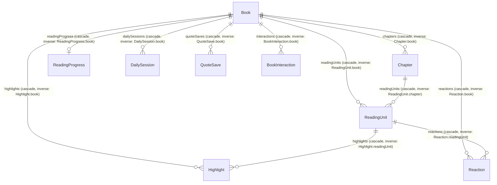
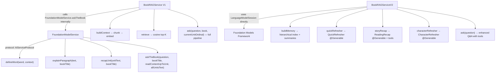

# Spine — Lossless Technical Recreation Spec

> **Scope**: This document is a **complete architecture and implementation blueprint** for the Spine iOS app. It specifies every data model, service, algorithm, enum, relationship, and view state machine with enough precision to recreate the project from scratch, audit every component, or feed to an LLM for full reconstruction.

---

## 1. Project Identity

| Key | Value |
|-----|-------|
| **App Name** | Spine |
| **Bundle ID** | `com.spine.app` |
| **Platform** | iOS 26+, Swift 6, SwiftUI |
| **Tagline** | "A beautiful reading gym for ambitious people" |
| **Data Layer** | SwiftData (fully local persistence — no CloudKit sync for models) |
| **AI Layer** | Apple Foundation Models (fully on-device, no API keys, no network) |
| **CloudKit** | Container `iCloud.com.spine.app` — used **only** for social features via `CloudKitSocialService`. No SwiftData models sync to CloudKit. |
| **Xcode** | 26+ (iOS 26 SDK) |
| **Dependencies** | Zero external — pure Apple frameworks (SwiftUI, SwiftData, FoundationModels, NaturalLanguage, CloudKit) |

---

## 2. Project Structure

```
Spine/
├── App/
│   └── SpineApp.swift
├── Design/
│   ├── DesignTokens.swift
│   └── Components.swift
├── Extensions/
│   ├── Color+Hex.swift
│   └── Extensions.swift
├── Features/
│   ├── Gamification/
│   ├── Highlights/
│   ├── Library/
│   ├── Onboarding/
│   ├── Profile/
│   ├── Reactions/
│   ├── Reader/
│   ├── Social/
│   └── Today/
├── Models/
├── Services/
│   └── EPUBParser/
├── SeedData/
│   └── SeedCatalog.swift
├── Stubs/
│   └── FeatureFlags.swift
├── Info.plist
└── Spine.entitlements
```

---

## 3. Data Model (SwiftData)

### 3.1 Entity Relationship Diagram



> [!IMPORTANT]
> **Ordering**: `Book.sortedUnits` and `Book.sortedChapters` are **computed properties** that sort on `.ordinal`. SwiftData relationship arrays are **unordered**. All ordered access goes through these computed getters.

### 3.2 Terminology

| Term | Definition | Scope |
|------|-----------|-------|
| **Chapter** | Structural unit from the EPUB spine. 1:1 with EPUB `<spine>` entries. | Parser output |
| **ReadingUnit** | Consumption unit — a ~5–10 minute reading segment (~1500–3000 words). Generated by `SegmentationEngine` from chapters. | App-facing |
| **Unit Summary** | 2-sentence summary generated from **one ReadingUnit's plainText** | V2 RAG |
| **Chapter Summary** | 1-sentence condensation generated from a **unit summary** (NOT from Chapter.plainText) | V2 RAG |
| **Arc Summary** | 1-paragraph synthesis generated from **3 consecutive chapter summaries** (every 3 units) | V2 RAG |

> [!CAUTION]
> In the current implementation, "chapter summaries" are keyed by **unit ordinal**, not by Chapter.ordinal. This is because a Chapter may have multiple ReadingUnits. The label "chapter summary" refers to a condensed version of a unit summary — it does not aggregate all units within a Chapter. A future refactor should consider true per-Chapter summaries.

---

## 4. AI Layer — Service Hierarchy

> [!IMPORTANT]
> **Canonical call paths** — an implementer must build exactly these three services and their boundaries.



| Service | Role | Called By | Model Access |
|---------|------|-----------|-------------|
| `FoundationModelService` | **Low-level model wrapper**. Wraps `LanguageModelSession` for simple prompt→response tasks. Conforms to `AIServiceProtocol`. | `BookRAGService.ask()`, ReaderView (define word, explain paragraph) | `SystemLanguageModel.default` |
| `BookRAGService` (V1) | **Flat-chunk Q&A**. Semantic retrieval over 500-word chunks with 50-word overlap. Calls `FoundationModelService.askTheBook()` for generation. | `AskTheBookView` (when `advancedRecap` flag is off) | Via `FoundationModelService` |
| `BookRAGServiceV2` | **Hierarchical recap engine**. 5-tier memory, mode-specific scoring, diversity rerank, tool calling. Uses `LanguageModelSession` directly with `@Generable` structured output. | `RecapView`, potentially `AskTheBookView` (when `advancedRecap` flag is on) | `LanguageModelSession` directly |

> `FoundationModelService.askTheBook()` is **not legacy** — it remains the generation backend used by `BookRAGService` V1. V2 bypasses it entirely and talks to `LanguageModelSession` directly with tools and structured output.

---

## 5. Ingestion Pipeline

**File**: `IngestionPipeline.swift` — `@MainActor final class`

**Flow**: EPUB file → Copy to `Documents/EPUBs/` → Parse → Create Book + Chapters → Segment → Create ReadingUnits → Create ReadingProgress → Embed synopsis → Save

### 5.1 EPUB Parser (`EPUBParser/`)

| File | Lines | Role |
|------|-------|------|
| `EPUBParser.swift` | ~520 | Unzip → `container.xml` → `content.opf` → metadata + spine + manifest → per-chapter HTML+plainText extraction. Cover image extraction. |
| `ContentNormalizer.swift` | ~240 | Strip scripts/styles/non-content. Normalize whitespace/encoding. Clean HTML for rendering. |
| `EPUBModels.swift` | ~40 | `ParsedEPUB`, `ParsedChapter`, `EPUBMetadata` value types |

### 5.2 Segmentation Engine (`SegmentationEngine.swift`)

**Config**: `minWords: 1500, maxWords: 3000, targetWords: 2250, wordsPerMinute: 225`

**Algorithm**:
```
for each chapter:
  if chapter.wordCount ∈ [minWords, maxWords] → 1 unit
  if chapter.wordCount < minWords → 1 unit (never merge across chapters)
  if chapter.wordCount > maxWords → split:
    accumulate paragraphs
    when accumulated words ≥ targetWords:
      search last ~33% of accumulated paragraphs for best break
      break priority (highest first):
        1. Scene breaks: "* * *", "---", "⁂", "***", "—", 3+ whitespace-only lines
        2. All-caps headings or "Chapter/Part/Act/Scene/Letter" prefixes
        3. Date-like lines (regex: /^\d{1,2}\s+\w+\s+\d{4}/ — epistolary detection)
        4. Dialogue transitions: closing quote → non-quote next paragraph
        5. Sentence boundary (period/question/exclamation at end of paragraph)
        6. Paragraph boundary (fallback)
      if no break found and words > maxWords → force-split at paragraph boundary
```

**Output**: `[SegmentedUnit]` — each has `ordinal` (global 0-indexed), `title`, `plainText`, `htmlContent`, `wordCount`, `estimatedMinutes`, `startCharOffset`, `endCharOffset`.

---

## 6. Recommendation Engine

**File**: `RecommendationService.swift` — `struct RecommendationService: Sendable`

### 6.1 Scoring Formula

```
score = 0.30 × genreMatch
      + 0.25 × vibeMatch
      + 0.20 × synopsisSimilarity
      + 0.15 × coLiked
      + 0.10 × noveltyBonus
      − 0.40 × avoidedVibePenalty
```

### 6.2 Signal Computation (exact)

**genreMatch**:
```swift
let matchingGenres = book.genres.filter { g in
    profile.preferredGenres.contains { $0.name == g }
}
let totalWeight = matchingGenres.reduce(0.0) { sum, g in
    sum + (profile.preferredGenres.first { $0.name == g }?.weight ?? 0)
}
return profile.preferredGenres.isEmpty ? 0 : totalWeight / Double(profile.preferredGenres.count)
```

**vibeMatch**: Same structure as genreMatch but over `book.vibes` vs `profile.preferredVibes`.

**avoidedVibePenalty**: `book.vibes.contains(where: { profile.avoidedVibes.contains($0) }) ? 1.0 : 0.0`

**synopsisSimilarity**: Average cosine similarity between `book.synopsisEmbedding` and each liked book's `synopsisEmbedding` (liked = `BookInteraction` with `.rated` and `rating >= 3`, or `.finished`).

**coLiked**: For each liked book, count shared genres + shared vibes between candidate and liked book. Normalize by total candidate genres+vibes. Average across all liked books. *(Placeholder — future: `MLRecommender`)*

**noveltyBonus**: `1.0 - (sameGenreCount / totalCandidates)` where `sameGenreCount` = number of candidates sharing the candidate's primary genre. `totalCandidates` = candidates.count. If `totalCandidates == 0`, returns 0.

### 6.3 Exclusion

Books excluded if user has `BookInteraction` with `.finished` or `.dismissed` for that book.

### 6.4 Output

Returns `[ScoredBook]` — `(book: Book, score: Double, rationale: String)`.

### 6.5 Taste Profile Evolution

| Method | Effect |
|--------|--------|
| `reinforceVibe(_:boost:)` | `weight += boost` (default 0.1), capped at 1.0. If vibe not in `preferredVibes`, adds it at weight `0.5 + boost`. |
| `penalizeVibe(_:)` | `weight -= 0.15`. If weight drops below 0.1, removes from `preferredVibes` and adds to `avoidedVibes`. |

---

## 7. Embedding Service

**File**: `EmbeddingService.swift` — `struct EmbeddingService: Sendable`

| Method | Signature | Notes |
|--------|-----------|-------|
| `embed(text:)` | `(String) → [Double]?` | `NLEmbedding.sentenceEmbedding(for: .english)` |
| `cosineSimilarity(_:_:)` | `([Double], [Double]) → Double` | dot / (‖a‖ × ‖b‖) |
| `encode(_:)` | `([Double]) → Data` | `JSONEncoder` serialization |
| `decode(_:)` | `(Data) → [Double]` | `JSONDecoder` deserialization |

---

## 8. BookRAGService V1

**File**: `BookRAGService.swift` — `struct BookRAGService: Sendable`

1. **`buildContext(book:upToUnit:chunkSize:)`**: Chunks all read units into 500-word segments with 50-word overlap. Embeds each chunk via `EmbeddingService`.
2. **`retrieve(query:from:topK:)`**: Cosine similarity ranking, returns top-3. Fallback: last 3 chunks if query embedding fails.
3. **`ask(question:book:currentUnitOrdinal:)`**: Full pipeline → calls `FoundationModelService.askTheBook()` with retrieved chunks as context.

---

## 9. Advanced RAG System (V2)

### 9.1 BookMemoryIndex (`BookMemoryIndex.swift`)

**Class**: `final class BookMemoryIndex: @unchecked Sendable`

**MemoryEntry** struct:

| Field | Type | Purpose |
|-------|------|---------|
| `id` | `String` | Pattern: `"{tier}-{unitOrdinal}-{counter}"` |
| `text` | `String` | Content |
| `embedding` | `[Double]` | NLEmbedding vector |
| `unitOrdinal` | `Int` | Source position |
| `tier` | `Tier` | `.chunk(0)`, `.scene(1)`, `.unitSummary(2)`, `.chapterSummary(3)`, `.arcSummary(4)` |
| `entityMentions` | `Set<String>` | Lowercased names from NLTagger |
| `eventDensity` | `Double` | See formula below |
| `sourceRange` | `ClosedRange<Int>` | Start–end unit ordinals |
| `adjacentEntryIDs` | `[String]` | Linked neighbors for expansion |

**eventDensity formula**:
```
markers = ["said","told","asked","replied","went","came","arrived","left","found",
           "discovered","realized","learned","killed","died","married","fought",
           "escaped","suddenly","finally"]
words = text.lowercased().split(" ")
if words.count ≤ 10: return 0
count = words matching any marker (after trimming punctuation)
return min(1.0, count / words.count × 10.0)
```

**Entity side-index**: `entityIndex: [String: EntityEntry]` — key = `name.lowercased()`, value stores `(name: String, type: String, unitOrdinals: Set<Int>, totalMentions: Int)`.

**Build process** (`buildIndex(from:upToUnit:chunkSize:overlapSize:)`):
1. For each read unit:
   - Produce chunks: `chunkSize=300` words, `overlapSize=50` words overlap
   - Produce scenes: `text.components(separatedBy: "\n\n")`, filtered to `>50 chars`
   - Link adjacent chunk IDs bidirectionally
   - Run NLTagger for entity extraction
2. Set `isBuilt = true`

**Summary injection** (called by `BookRAGServiceV2.buildMemory()`):
- `addUnitSummary(_:forUnit:)` → adds `.unitSummary` entry, keys to `unitSummaries[ordinal]`
- `addChapterSummary(_:forUnit:)` → adds `.chapterSummary` entry, keys to `chapterSummaries[ordinal]`
- `addArcSummary(_:startUnit:endUnit:)` → adds `.arcSummary` entry, keys to `arcSummaries[startUnit]`

### 9.2 BookRAGServiceV2 (`BookRAGServiceV2.swift`)

**Class**: `final class BookRAGServiceV2: @unchecked Sendable`

**`buildMemory(book:upToUnit:)`** — called lazily by every public method:
```
if memoryIndex.isBuilt: return
memoryIndex.buildIndex(from: book, upToUnit: currentOrdinal)
for each readUnit where unitSummaries[ordinal] == nil:
    unitSummary = summarize(unit.plainText, prompt: "Summarize in 2 sentences…")
    memoryIndex.addUnitSummary(unitSummary, forUnit: ordinal)
for each readUnit where chapterSummaries[ordinal] == nil:
    if unitSummary exists:
        chapterSummary = summarize(unitSummary, prompt: "Rewrite as one-sentence chapter recap…")
        memoryIndex.addChapterSummary(chapterSummary, forUnit: ordinal)
arcStart = 0, arcSize = 3
while arcStart + arcSize - 1 <= currentOrdinal:
    combined = chapterSummaries[arcStart..arcStart+arcSize-1].joined
    arcSummary = summarize(combined, prompt: "Synthesize into one paragraph…")
    memoryIndex.addArcSummary(arcSummary, startUnit: arcStart, endUnit: arcStart+arcSize-1)
    arcStart += arcSize
```

**`summarize(text:bookTitle:prompt:)`** — private, separate `LanguageModelSession` per call:
```
if !FoundationModelService.isAvailable: return nil
truncate to 1500 words
try session.respond(to:) → return response.content
catch: log warning → return nil  // handles safety guardrails gracefully
```

### 9.3 Three-Stage Retrieval (`assembleMemoryPack`)

**Stage 1 — Per-tier budget selection** (`retrievePerTier`):

| Mode | arc | chapter | unit | scene | chunk |
|------|-----|---------|------|-------|-------|
| `.quick` | 0 | 2 | 3 | 1 | 0 |
| `.storySoFar` | 2 | 3 | 2 | 3 | 0 |
| `.character()` | 1 | 2 | 1 | 4 | 2 |

Within each tier: score all candidates, take top N.

**Scoring function** (`computeScore`):
```
similarity = max(0, cosineSimilarity(queryEmbed, entry.embedding))
   // 0 if either embedding is empty

distance = currentUnitOrdinal - entry.unitOrdinal
maxDist = max(1.0, currentUnitOrdinal)
recency = exp(-2.0 × distance / maxDist)

gap = abs(entry.unitOrdinal - currentUnitOrdinal)
proximity = 1.0 if gap ≤ 2, 0.5 if gap ≤ 5, 0.1 otherwise

entityOverlap = |queryEntities ∩ entry.entityMentions| / |queryEntities|
   // 0 if either set is empty

tierBoost = {arcSummary: 1.0, chapterSummary: 0.8, unitSummary: 0.6, scene: 0.3, chunk: 0.0}

score = w.semantic × similarity + w.recency × recency + w.proximity × proximity
      + w.entity × entityOverlap + w.summaryTier × tierBoost
```

**Mode weights**:
```
              semantic  recency  proximity  entity  summaryTier
Quick           0.10     0.35      0.25     0.10      0.20
Story So Far    0.20     0.15      0.10     0.10      0.45
Character       0.15     0.10      0.05     0.50      0.20
```

**Stage 2 — Diversity reranking** (`rerankWithDiversity`):
```
result = [], remaining = all Stage 1 entries, usedUnitCounts = {}
while remaining not empty:
    for each candidate in remaining:
        unitCount = usedUnitCounts[candidate.unitOrdinal] ?? 0
        diversityPenalty = unitCount × 0.3
        tierBonus = candidate.tier.rawValue × 0.1
        redundancyPenalty = 0
        for each already-selected entry:
            if cosineSimilarity > 0.85: redundancyPenalty += 0.5
        score = tierBonus - diversityPenalty - redundancyPenalty
    select max-score candidate
    add to result, increment usedUnitCounts
```

**Stage 3 — Adjacent expansion** (`expandWithNeighbors`):
```
for top 2 scene/chunk entries:
    get neighbors via memoryIndex.neighbors(of: entry.id)
    filter: neighbor.unitOrdinal ≤ currentUnitOrdinal AND not already in result
    add to result
sort result by unitOrdinal (narrative order)
```

**Memory pack assembly**:
```
for each entry in expanded:
    entryWords = entry.text.split(" ").count
    if wordCount + entryWords > maxWords: skip
    pack += "[{tier.label} — Unit {unitOrdinal + 1}]\n{entry.text}"
    wordCount += entryWords
return pack.joined(separator: "\n\n---\n\n")
```

Word budgets: Quick=600, StorySoFar=800, Character=700, Ask=700.

### 9.4 @Generable Structured Output (`ReadingRecap.swift`)

```swift
@Generable(description: "A spoiler-safe reading recap")
struct ReadingRecap {
    @Guide(description: "Key plot events, max 7")      let majorEvents: [String]
    @Guide(description: "Where major characters stand") let characterUpdates: [CharacterUpdate]
    @Guide(description: "Unresolved plot threads")      let unresolvedThreads: [String]
    @Guide(description: "Details the reader should remember") let importantDetailsToRemember: [String]
    @Guide(description: "One paragraph story recap")    let recapParagraph: String
    @Guide(description: "Coverage note, e.g. Focused on Chapters 1-12") let coverageNote: String
}

@Generable(description: "Character state")
struct CharacterUpdate {
    @Guide(description: "Name")                     let name: String
    @Guide(description: "Current status, 1 sentence") let status: String
}

@Generable(description: "Quick refresher bullets")
struct QuickRefresher {
    @Guide(description: "5-7 recent event bullets") let bullets: [String]
}

@Generable(description: "Major character statuses")
struct CharacterRefresher {
    @Guide(description: "Each major character's status") let characters: [CharacterUpdate]
}
```

### 9.5 Tool Calling (`BookRetrievalTools.swift`)

Three compact tools. All conform to `Tool` protocol. Used for **bounded follow-up only**.

| Tool | Args | Output |
|------|------|--------|
| `RecentChapterSummariesTool` | `count: Int` (max 5) | Top-N chapter summaries, most recent first |
| `SearchRelevantScenesTool` | `query: String` | Top-3 scenes by cosine similarity, spoiler-bounded |
| `CharacterArcTool` | `characterName: String` | Mention count + unit appearances |

All tool outputs are terse strings (~50–200 chars) to conserve the 4096-token context window.

---

## 10. Character Tracker & Codex

### 10.1 CharacterTracker (`CharacterTracker.swift`)

**Struct**: `struct CharacterTracker: Sendable`

**Entity extraction**: `NLTagger(tagSchemes: [.nameType])` with `.joinNames` option.

**Normalization**: `name.capitalized` after `trimmingCharacters(in: .whitespacesAndNewlines)`. Names < 2 chars are skipped.

Two modes:
1. **`extractCharacters(from:upToUnit:) → [CharacterInfo]`**: All `.personalName` entities from read units. Sorted by mention count. Loads from cached `book.characterGraphJSON` first (filtered to `firstAppearanceUnit ≤ currentOrdinal`).
2. **`extractEntities(from:) → [EntityInfo]`**: Single-unit X-Ray. Extracts `.personalName` ("person"), `.placeName` ("place"), `.organizationName` ("organization").

### 10.2 CodexView

Filter pills: All / Characters / Locations / Groups. Entity cards with mention counts and first appearance. Tappable detail with AI-generated description via `FoundationModelService.askTheBook`. Spoiler-safe.

---

## 11. Gamification System

### 11.1 XP Engine (`XPEngine.swift`)

**Struct**: `@MainActor struct XPEngine`

| Component | Value | Condition |
|-----------|-------|-----------|
| Base XP | `10` | Always |
| Streak Bonus | `+2 × currentStreak` | Capped at `+20` |
| Speed Bonus | `+5` | If WPM > `profile.averageWPM` AND `averageWPM > 0` |
| First of Day | `+5` | If `profile.dailyXPDate < today` |
| Book Finish | `+50` | If `book.readingUnits.allSatisfy { $0.isCompleted }` |

**WPM calculation**: `wordCount / minutesSpent` — returns 0 if `minutesSpent < 0.1` (avoids near-zero division).

### 11.2 XP Profile (`XPProfile.swift`)

**WPM tracking**: Exponential moving average — `averageWPM = 0.3 × wpm + 0.7 × averageWPM` (first session: `averageWPM = wpm`). Sanity check: `wpm > 0 && wpm < 1500`.

**Consistency**: `consistencyScore = Double(dailyGoalHitsThisWeek) / 7.0`

**Level thresholds** (all 15):

| Level | XP | Title |
|-------|----|-------|
| 1 | 0 | Bookworm |
| 2 | 50 | Page Turner |
| 3 | 150 | Chapter Chaser |
| 4 | 300 | Story Seeker |
| 5 | 500 | Novel Navigator |
| 6 | 750 | Prose Pathfinder |
| 7 | 1100 | Verse Voyager |
| 8 | 1500 | Tome Traveler |
| 9 | 2000 | Literary Lion |
| 10 | 2700 | Saga Scholar |
| 11 | 3500 | Epic Explorer |
| 12 | 4500 | Canon Keeper |
| 13 | 5500 | Spine Master |
| 14 | 7000 | Archive Architect |
| 15 | 9000 | Grand Librarian |

`levelProgress = (totalXP - xpForCurrentLevel) / (xpForNextLevel - xpForCurrentLevel)`

### 11.3 Achievement Engine (`AchievementEngine.swift`)

16 achievements across 4 categories. Check function is `@MainActor`.

| ID | Name | Threshold | Category |
|----|------|-----------|----------|
| `first_unit` | First Steps | units ≥ 1 | Milestones |
| `units_10` | Getting Started | units ≥ 10 | Milestones |
| `units_50` | Dedicated | units ≥ 50 | Milestones |
| `units_100` | Centurion | units ≥ 100 | Milestones |
| `book_1` | One Down | books ≥ 1 | Milestones |
| `book_5` | Shelf Builder | books ≥ 5 | Milestones |
| `streak_3` | On a Roll | streak ≥ 3 | Streaks |
| `streak_7` | Week Warrior | streak ≥ 7 | Streaks |
| `streak_14` | Fortnight Force | streak ≥ 14 | Streaks |
| `streak_30` | Iron Will | streak ≥ 30 | Streaks |
| `speed_200` | Swift Reader | WPM ≥ 200 | Skills |
| `speed_300` | Speed Demon | WPM ≥ 300 | Skills |
| `xp_100` | Century | dailyXP ≥ 100 | Skills |
| `consistent_7` | Rock Solid | dailyGoalHits ≥ 7 | Skills |
| `night_owl` | Night Owl | hour ≥ 22 OR hour < 4 | Lifestyle |
| `early_bird` | First Light | 4 ≤ hour < 7 | Lifestyle |

### 11.4 Streak Calculator (`StreakCalculator.swift`)

**Struct**: `struct StreakCalculator: Sendable`

Algorithm:
```
readingDays = Set of startOfDay(session.sessionDate) for completed sessions
if readingDays is empty: return (0, 0, false)
sortedDays = readingDays.sorted()

currentStreak:
    checkDate = today
    if today in sortedDays: streak=1, check yesterday
    else: check yesterday; if yesterday in sortedDays: streak=1, else return 0
    while checkDate in sortedDays: streak++, checkDate -= 1 day

longestStreak:
    walk sortedDays; if consecutive day gap == 1: current++; else: current=1
    track max
```

---

## 12. Social Layer (CloudKit)

**File**: `CloudKitSocialService.swift` — container `iCloud.com.spine.app`

| Function | CKRecord Type | Notes |
|----------|---------------|-------|
| `getDiscussion(bookId:unitOrdinal:)` | `DiscussionPost` | Gracefully handles missing record type (returns `[]`) |
| `postToDiscussion(…text:)` | `DiscussionPost` | `DiscussionView` does optimistic local append after save |
| `shareHighlight(…)` | `SharedHighlight` | |
| `getPublicProfile(userId:)` | `PublicProfile` | |
| Club operations | `ReadingClub` | Create, join, fetch |

### 12.1 ReadingClub Persistence Boundary

`ReadingClub` is a **local-only SwiftData model** with a `cloudKitRecordId: String?` field. It is **never auto-synced** by SwiftData. When a club is created or joined, `CloudKitSocialService` manually saves/fetches `CKRecord`s and the local SwiftData model is updated separately. The local model caches cloud state for offline access.

---

## 13. Design System (`SpineTokens`)

### 13.1 Color Palette

| Token | Hex | Usage |
|-------|-----|-------|
| `cream` | `#FAF7F2` | Primary background |
| `warmStone` | `#E8E0D8` | Secondary background |
| `parchment` | `#F5F0E8` | Card backgrounds |
| `espresso` | `#4A3728` | Primary text |
| `ink` | `#1C1C1E` | Dark text |
| `accentGold` | `#C49B5C` | Primary accent, buttons, active states |
| `accentAmber` | `#D4A853` | Secondary accent |
| `streakFlame` | `#E8734A` | Streak displays, urgency |
| `successGreen` | `#4CAF82` | Completion states |
| `subtleGray` | `#8E8E93` | Secondary text |

### 13.2 Reader Themes

| Theme | Background | Text |
|-------|-----------|------|
| `.light` | `cream` | `espresso` |
| `.sepia` | `#F4ECD8` | `#5B4636` |
| `.dark` | `#1C1C1E` | `#E5E5EA` |

### 13.3 Spacing Scale (in points)

`xxxs:2, xxs:4, xs:8, sm:12, md:16, lg:24, xl:32, xxl:48, xxxl:64`

---

## 14. Reader State Machine (`ReaderView.swift`)

### 14.1 Sheet State Machine

Single-sheet enum pattern — only one sheet can be active at a time:

```swift
enum ReaderSheet: Identifiable {
    case settings, reaction, highlight, microReason,
         defineWord, explainParagraph, askTheBook,
         codex, recap, discussion, shareHighlight
    var id: String { String(describing: self) }
}
@State private var activeSheet: ReaderSheet?
```

Presented via single `.sheet(item: $activeSheet)`.

### 14.2 Toolbar Enable Rules

| Button | Icon | Condition |
|--------|------|-----------|
| Ask the Book | `bubble.left.and.text.bubble.right` | `FeatureFlags.shared.askTheBook` |
| Codex | `text.book.closed` | `characterGraph ∥ xRay` |
| Recap | `clock.badge.checkmark` | `advancedRecap` |
| Discussion | `bubble.left.and.bubble.right.fill` | `chapterGatedDiscussions && currentUnit.isCompleted` |
| Settings | `textformat.size` | Always |

### 14.3 Unit Completion Flow

```
1. completeCurrentUnit() called
2. ProgressTracker.completeUnit() marks unit + session
3. XPEngine.awardXP() → XPReward
4. modelContext.save()
5. if didLevelUp || newAchievements: showCelebration = true (fullScreenCover)
   else: showXPToast = true (overlay)
6. if completedCount % 5 == 0: after 3s delay, if no sheet active → activeSheet = .microReason
```

**No auto-recap** — the recap button is in the toolbar for manual access.

### 14.4 Text Selection Actions (via UIKit `editMenuInteraction`)

| Action | Requires Flag | Sets |
|--------|--------------|------|
| Highlight | — | `highlightText` → `.highlight` sheet |
| Share Quote | `highlightSharing` | `highlightText` → `.shareHighlight` sheet |
| Explain | `explainParagraph` | `selectedParagraph` → `.explainParagraph` sheet |
| Define Word | `defineWord` | `selectedWord`, `selectedParagraph` → `.defineWord` sheet |

### 14.5 AI Unavailability

`FoundationModelService.isAvailable` checks `SystemLanguageModel.default.isAvailable`. If false:
- `summarize()` returns nil → unit/chapter/arc summaries are skipped, memory index builds without them
- Feature flag buttons still show (they check flags, not model availability)
- Runtime errors caught and displayed in view error states

### 14.6 RecapView Caching & Generation

- Generation starts **on appear** of the view (not on tab switch)
- Three `@State` results cached: `quickResult`, `storyResult`, `characterResult`
- Switching tabs checks if result is already cached; if yes, displays immediately without regeneration
- Cache is scoped to the `RecapView` instance — dismissed and re-presented creates a new instance (cache cleared)
- Switching books means navigating away and back, creating a new `RecapView` (cache cleared)
- Invalidation: none beyond instance lifetime

---

## 15. Feature Flags (`FeatureFlags.swift`)

| Phase | Flags (all `true` = shipped) |
|-------|-----|
| **1: Core Habit** | `epubIngestion`, `dailySegmentation`, `streakTracking`, `highlights`, `reactions` |
| **2: AI Foundations** | `arbitraryEPUBImport`, `defineWord`, `explainParagraph`, `unitRecap`, `librarySync` (false) |
| **3: Intelligence** | `progressAwareRetrieval`, `characterGraph`, `askTheBook`, `xRay`, `advancedRecap` |
| **4: Social** | `chapterGatedDiscussions`, `readingClubs`, `publicProfiles`, `highlightSharing` |

---

## 16. Seed Data

Bundled Project Gutenberg EPUBs auto-ingested on first launch via `SeedCatalog.swift`:
- Pride and Prejudice, Wuthering Heights, Frankenstein, Romeo and Juliet, Alice's Adventures in Wonderland, The Great Gatsby

Each has pre-assigned `genres` and `vibes` for immediate recommendation scoring.

---

## 17. Tab Navigation

| Tab | View | Icon |
|-----|------|------|
| Today | `TodayView` | `sun.max.fill` |
| Library | `LibraryView` | `books.vertical.fill` |
| Highlights | `HighlightsView` | `highlighter` |
| Social | `ReadingClubView` | `person.2.fill` |
| Profile | `ProfileView` | `person.fill` |

---

## 18. Key Architectural Decisions

1. **Reading Units ≠ Chapters**: Chapters are EPUB structural. ReadingUnits are consumption-sized (~5–10 min). This enables daily habits, per-unit progress, and precise spoiler ceilings.

2. **Spoiler ceiling enforced at data layer**: Every AI service filters by `unitOrdinal ≤ currentUnitOrdinal`. This is enforced in `BookRAGService`, `BookRAGServiceV2`, `CharacterTracker`, and `FoundationModelService`.

3. **Recap ≠ QA**: `BookRAGService` (V1) is flat-chunk semantic search for Q&A ("Who is Darcy?"). `BookRAGServiceV2` is hierarchical memory reconstruction for recap ("What happened so far?"). Different retrieval strategies, different output schemas.

4. **App-driven first-pass retrieval**: V2's retrieval is controlled by the app (tier budgets, scoring weights, diversity reranking). Foundation Models tool calling is bounded to supplemental follow-up — the model cannot bypass the spoiler ceiling or waste tokens on unbounded tool calls.

5. **On-device AI only**: No API keys, no network calls for AI. `SystemLanguageModel.default`. Graceful degradation if unavailable.

6. **Event-driven taste profile**: `UserTasteProfile` evolves from onboarding (`setOnboardingGenres`, `setOnboardingVibes`) through ongoing `reinforceVibe` / `penalizeVibe` micro-signals.

7. **Token budget management** (4096-token context window): Hierarchical summaries carry more signal per token; compact `@Generable` schemas (3–5 word `@Guide` descriptions); separate summarization sessions; terse tool outputs; hard word limits on memory packs.

---

## Appendix A: Storage Schema

### Book

```swift
@Model final class Book {
    @Attribute(.unique) var id: UUID
    var title: String
    var author: String
    var bookDescription: String
    @Attribute(.externalStorage) var coverImageData: Data?
    var sourceType: BookSourceType                       // .gutenberg | .local
    var language: String                                  // default "en"
    var gutenbergId: String?
    var localFileURI: String?
    var tocJSON: String?
    var manifestJSON: String?
    var spineJSON: String?
    var importStatus: ImportStatus                        // .pending→.parsing→.segmenting→.completed|.failed
    var importError: String?
    var rawMetadataJSON: String?
    var genres: [String]
    var vibes: [String]
    @Attribute(.externalStorage) var synopsisEmbedding: Data?
    var popularityScore: Double
    @Attribute(.externalStorage) var characterGraphJSON: String?
    var createdAt: Date
    var updatedAt: Date

    @Relationship(deleteRule: .cascade, inverse: \Chapter.book)          var chapters: [Chapter] = []
    @Relationship(deleteRule: .cascade, inverse: \ReadingUnit.book)       var readingUnits: [ReadingUnit] = []
    @Relationship(deleteRule: .cascade, inverse: \ReadingProgress.book)   var readingProgress: ReadingProgress?
    @Relationship(deleteRule: .cascade, inverse: \Highlight.book)         var highlights: [Highlight] = []
    @Relationship(deleteRule: .cascade, inverse: \DailySession.book)      var dailySessions: [DailySession] = []
    @Relationship(deleteRule: .cascade, inverse: \Reaction.book)          var reactions: [Reaction] = []
    @Relationship(deleteRule: .cascade, inverse: \QuoteSave.book)         var quoteSaves: [QuoteSave] = []
    @Relationship(deleteRule: .cascade, inverse: \BookInteraction.book)   var interactions: [BookInteraction] = []

    // Computed (not stored):
    var sortedUnits: [ReadingUnit]   { readingUnits.sorted { $0.ordinal < $1.ordinal } }
    var sortedChapters: [Chapter]    { chapters.sorted { $0.ordinal < $1.ordinal } }
    var totalWordCount: Int          { chapters.reduce(0) { $0 + $1.wordCount } }
    var unitCount: Int               { readingUnits.count }
}
```

### Chapter

```swift
@Model final class Chapter {
    @Attribute(.unique) var id: UUID
    var book: Book?                                       // inverse of Book.chapters
    var ordinal: Int
    var title: String
    var sourceHref: String
    @Attribute(.externalStorage) var plainText: String
    @Attribute(.externalStorage) var htmlContent: String
    var wordCount: Int
    var createdAt: Date

    @Relationship(deleteRule: .cascade, inverse: \ReadingUnit.chapter)
    var readingUnits: [ReadingUnit] = []

    var sortedUnits: [ReadingUnit] { readingUnits.sorted { $0.ordinal < $1.ordinal } }
}
```

### ReadingUnit

```swift
@Model final class ReadingUnit {
    @Attribute(.unique) var id: UUID
    var book: Book?                                       // inverse of Book.readingUnits
    var chapter: Chapter?                                 // inverse of Chapter.readingUnits
    var ordinal: Int
    var title: String
    @Attribute(.externalStorage) var plainText: String
    @Attribute(.externalStorage) var htmlContent: String
    var wordCount: Int
    var estimatedMinutes: Double
    var startCharOffset: Int
    var endCharOffset: Int
    var createdAt: Date
    var isCompleted: Bool
    var completedAt: Date?

    @Relationship(deleteRule: .cascade, inverse: \Highlight.readingUnit) var highlights: [Highlight] = []
    @Relationship(deleteRule: .cascade, inverse: \Reaction.readingUnit)  var reactions: [Reaction] = []
}
```

### ReadingProgress

```swift
@Model final class ReadingProgress {
    @Attribute(.unique) var id: UUID
    var book: Book?                                       // inverse of Book.readingProgress
    var currentUnitId: UUID?
    var completedUnitCount: Int
    var completedPercent: Double                           // 0.0–1.0
    var lastReadAt: Date?
    var streakAnchorDate: Date?
    var currentStreak: Int
    var longestStreak: Int

    var isFinished: Bool { completedPercent >= 1.0 }

    func markUnitCompleted(nextUnitId: UUID?, totalUnits: Int) {
        completedUnitCount += 1
        completedPercent = totalUnits > 0 ? Double(completedUnitCount) / Double(totalUnits) : 0.0
        currentUnitId = nextUnitId
        lastReadAt = Date()
    }
}
```

### Highlight

```swift
@Model final class Highlight {
    @Attribute(.unique) var id: UUID
    var book: Book?                                       // inverse of Book.highlights
    var readingUnit: ReadingUnit?                          // inverse of ReadingUnit.highlights
    var selectedText: String
    var startLocator: Int                                  // char offset into ReadingUnit.plainText
    var endLocator: Int
    var noteText: String?
    var colorHex: String                                  // default "C49B5C"
    var isFavorite: Bool
    var createdAt: Date
    var updatedAt: Date
}
```

### DailySession

```swift
@Model final class DailySession {
    @Attribute(.unique) var id: UUID
    var book: Book?                                       // inverse of Book.dailySessions
    var readingUnitId: UUID?                               // NOT a @Relationship — UUID reference only
    var sessionDate: Date                                 // Calendar.current.startOfDay in init
    var startedAt: Date
    var completedAt: Date?
    var minutesSpent: Double

    var isCompleted: Bool { completedAt != nil }
}
```

### Reaction

```swift
@Model final class Reaction {
    @Attribute(.unique) var id: UUID
    var book: Book?                                       // inverse of Book.reactions
    var readingUnit: ReadingUnit?                          // inverse of ReadingUnit.reactions
    var reactionTypeRaw: String                           // stores ReactionType.rawValue
    var reflectionText: String?
    var createdAt: Date

    var reactionType: ReactionType? {                      // computed get/set over raw
        get { ReactionType(rawValue: reactionTypeRaw) }
        set { reactionTypeRaw = newValue?.rawValue ?? "" }
    }
}
```

### QuoteSave

```swift
@Model final class QuoteSave {
    @Attribute(.unique) var id: UUID
    var book: Book?                                       // inverse of Book.quoteSaves
    var readingUnitId: UUID?                               // UUID ref, NOT @Relationship
    var text: String
    var createdAt: Date
}
```

### BookInteraction

```swift
@Model final class BookInteraction {
    @Attribute(.unique) var id: UUID
    var interactionType: InteractionType
    var timestamp: Date
    var rating: Int?                                      // 1–5
    var reviewText: String?
    var likedReasons: [String]
    var dislikedReasons: [String]
    var dwellTimeSeconds: Double
    var completionPercent: Double
    @Relationship var book: Book?                         // inverse of Book.interactions
}
```

### UserTasteProfile

```swift
@Model final class UserTasteProfile {
    @Attribute(.unique) var id: UUID
    var preferredGenres: [TasteWeight]                    // JSON-encoded via Codable
    var preferredVibes: [TasteWeight]
    var avoidedVibes: [String]
    var pacePreference: PacePreference                    // .short|.medium|.long|.any
    var createdAt: Date
    var lastUpdated: Date
    var hasCompletedTasteOnboarding: Bool
}
// TasteWeight: struct { name: String, weight: Double (0.0–1.0) }
```

### XPProfile

```swift
@Model final class XPProfile {
    @Attribute(.unique) var id: UUID
    var totalXP: Int
    var dailyXP: Int
    var dailyXPDate: Date
    var weeklyXP: Int
    var weeklyXPReset: Date
    var averageWPM: Double
    var totalReadingSessions: Int
    var fastestWPM: Double
    var consistencyScore: Double
    var dailyGoalHitsThisWeek: Int
    var unlockedAchievementIDs: [String]
    var achievementDates: [String: Date]
    // 5 computed: currentLevel, levelTitle, xpForCurrentLevel, xpForNextLevel, levelProgress
}
```

### UserSettings

```swift
@Model final class UserSettings {
    @Attribute(.unique) var id: UUID
    var hasCompletedOnboarding: Bool
    var readingGoalRaw: Int                               // 5|10|15
    var readerThemeRaw: String                            // "light"|"sepia"|"dark"
    var fontSize: Double                                  // default 18.0
    var lineHeightMultiplier: Double                      // default 1.6
    var useSerifFont: Bool                                // default true
    var activeBookId: UUID?
    var wordsPerMinute: Int                               // default 225
    var dailyXPGoal: Int                                  // default 30
}
```

### ReadingClub

```swift
@Model final class ReadingClub {
    @Attribute(.unique) var id: UUID
    var name: String
    var clubDescription: String
    var bookId: UUID                                      // UUID ref, NOT @Relationship
    var currentUnit: Int
    var memberCount: Int
    var cloudKitRecordId: String?                          // CKRecord.ID string for manual sync
    var createdAt: Date
    var updatedAt: Date
}
```

---

## Appendix B: All Enums

```swift
enum BookSourceType: String, Codable, CaseIterable, Sendable {
    case gutenberg, local
}

enum ImportStatus: String, Codable, Sendable {
    case pending, parsing, segmenting, completed, failed
}

enum InteractionType: String, Codable, CaseIterable, Sendable {
    case finished, abandoned, rated, reviewed, readLater, dismissed, opened
}

enum ReaderTheme: String, Codable, CaseIterable, Sendable {
    case light, sepia, dark
}

enum ReadingGoal: Int, Codable, CaseIterable, Sendable {
    case fiveMinutes = 5, tenMinutes = 10, fifteenMinutes = 15
}

enum PacePreference: String, Codable, CaseIterable, Sendable {
    case short, medium, long, any   // <50K, 50K–100K, 100K+, no preference
}

enum ReactionType: String, Codable, CaseIterable, Sendable {
    case lovedIt = "Loved it"
    case confused = "Confused"
    case beautifullyWritten = "Beautifully written"
    case dark = "Dark"
    case funny = "Funny"
    case dense = "Dense"
}

enum RecapMode {
    case quick, storySoFar, character(name: String? = nil)
}

// BookMemoryIndex.MemoryEntry.Tier
enum Tier: Int, Sendable, Comparable {
    case chunk = 0, scene = 1, unitSummary = 2, chapterSummary = 3, arcSummary = 4
}

// Achievement.Category
enum Category: String, Sendable, CaseIterable {
    case streak = "Streaks", milestone = "Milestones", skill = "Skills", lifestyle = "Lifestyle"
}
```

---

## Appendix C: Context Window Management (4096 Tokens)

1. **Hierarchical retrieval**: Summaries (~50–100 words) carry more signal per token than raw chunks (~300 words)
2. **Compact @Generable schemas**: `@Guide` descriptions are 3–5 words; array lengths bounded in prompt
3. **Separate summarization sessions**: Each summary generated in a fresh `LanguageModelSession`, then stored
4. **Tool output compression**: All tool return values are terse strings (~50–200 chars)
5. **Memory pack budget**: Hard word limits enforced during assembly (600–800 words depending on mode)
6. **Safety guardrail handling**: If `LanguageModelSession` refuses to summarize content, `summarize()` catches the error, logs it, returns `nil`. The memory index is built without that summary — retrieval continues with available entries.
